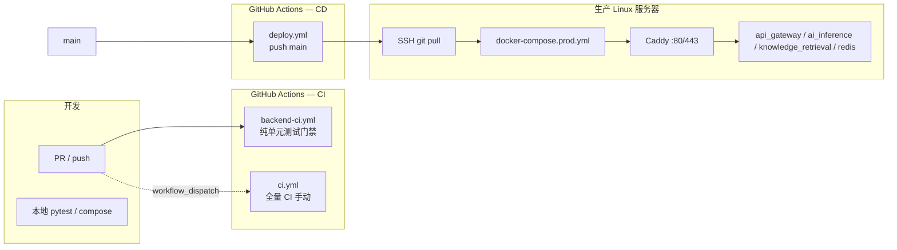
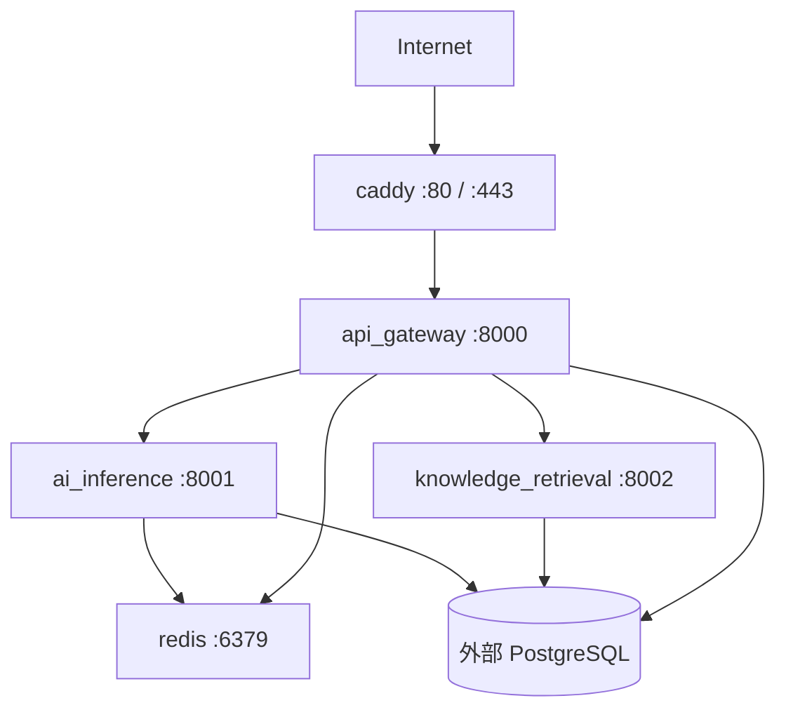

# AI 写作平台后端 — CI/CD 说明文档

本文档汇总 **ai-writing-platform-backend** 仓库中与持续集成（CI）、持续交付/部署（CD）相关的全部配置、流程与操作指南，供项目报告、运维交接与后续扩展使用。

> **与 README 的差异**：根目录 `README.md` / `README_CN.md` 中的「CI/CD」小节仍以 `.github/workflows/ci.yml` 为自动门禁描述；**当前实际生效的自动 CI 为 `backend-ci.yml`**。`ci.yml` 已临时关闭 `push` / `pull_request` 触发，仅保留手动 `workflow_dispatch`。下文以仓库内文件为准。

---

## 目录

1. [CI/CD 总览](#1-cicd-总览)
2. [GitHub Actions 工作流](#2-github-actions-工作流)
3. [测试体系与 CI 覆盖范围](#3-测试体系与-ci-覆盖范围)
4. [容器化与镜像构建](#4-容器化与镜像构建)
5. [部署流水线（CD）](#5-部署流水线cd)
6. [环境与密钥管理](#6-环境与密钥管理)
7. [反向代理与生产网络](#7-反向代理与生产网络)
8. [本地复现 CI / 预发布检查](#8-本地复现-ci--预发布检查)
9. [扩展与演进建议](#9-扩展与演进建议)
10. [附录：文件清单](#10-附录文件清单)

---

## 1. CI/CD 总览

### 1.1 流水线架构



### 1.2 设计原则（当前实现）

| 维度 | 策略 |
|------|------|
| **CI 门禁** | 最小可行：无 Docker、无 Postgres 服务容器，仅用 SQLite 文件库跑 `ai_inference` 相关用例 |
| **全量 CI** | `ci.yml` 保留矩阵构建、前端、Docker 冒烟、集成测试，但**不自动触发**，避免不稳定任务阻塞合并 |
| **CD** | `main` 分支推送 → SSH 登录目标机 → `git pull` → `docker compose -f docker-compose.prod.yml up -d --build` |
| **生产栈** | 根目录统一 `Dockerfile` + `docker-compose.prod.yml`（含 Caddy）；**不含** `pipelines`、`agents`（与开发用 `infrastructure/docker-compose.yml` 不同） |
| **数据库** | 开发与生产均依赖**外部 PostgreSQL**（如阿里云 RDS）；Compose 内不再内置 `postgres` 服务块 |

### 1.3 后端服务与端口

| 服务 | 端口 | 纳入 backend-ci | 纳入 docker-compose.prod | 纳入 infrastructure compose |
|------|------|-----------------|--------------------------|------------------------------|
| `api_gateway` | 8000 | ✅ | ✅ | ✅ |
| `ai_inference` | 8001 | ✅（SQLite） | ✅ | ✅ |
| `knowledge_retrieval` | 8002 | ❌ | ✅ | ✅ |
| `pipelines` | 8003 | ✅（仅 doc_processor 纯逻辑） | ❌ | ✅ |
| `agents` | 8004 | ❌ | ❌ | ✅ |
| `redis` | 6379 | — | ✅（容器） | ✅（可换 Railway） |
| `caddy` | 80/443 | — | ✅ | ❌ |

---

## 2. GitHub Actions 工作流

工作流文件位于 `.github/workflows/`。

### 2.1 `backend-ci.yml` — **当前自动 CI 门禁（后端）**

| 属性 | 值 |
|------|-----|
| **显示名称** | 后端纯单元测试 |
| **触发** | `push` / `pull_request` → `main`、`develop`；支持 `workflow_dispatch` |
| **Runner** | `ubuntu-latest` |
| **Python** | 3.12（`actions/setup-python@v5`，pip 缓存） |
| **Job** | 单 Job：`pure-unit-tests` |

#### Job 级环境变量

```yaml
DATABASE_URL: sqlite:////tmp/ai_inference_ci.sqlite
```

**原因**（与源码注释一致）：

1. `backend/ai_inference/db/database.py` 在**首次 import** 时读取 `DATABASE_URL`，必须在 `pytest` 启动前设置。
2. Gateway / pipelines doc_processor 单测不依赖该变量。
3. 使用 `/tmp` 下**文件型 SQLite**，避免 `:memory:` 与连接池多连接不共享同一库的问题。

#### 执行步骤摘要

| 步骤 | 命令 / 动作 |
|------|-------------|
| 检出 | `actions/checkout@v4` |
| Python | 3.12 + pip cache（`api_gateway`、`ai_inference`、`pipelines` 的 `requirements.txt`） |
| 安装依赖 | 上述三服务 `requirements.txt` + `pytest` |
| API Gateway | `pytest tests/unit/test_api_gateway.py -v --tb=short` |
| AI Inference | `pytest tests/unit/test_ai_inference.py -v --tb=short` |
| Pipelines 纯逻辑 | `pytest tests/unit/test_pipelines_doc_processor.py -v --tb=short` |
| 日志说明 | 成功后在日志打印「未纳入本 CI 的测试及原因」 |

#### 明确不纳入本 workflow 的测试

| 路径 | 原因 |
|------|------|
| `tests/integration/` | 需已启动的全栈服务 |
| `tests/unit/test_knowledge_retrieval.py` | `TestClient(app)` 触发 lifespan：`get_pool` + fastembed 预热，依赖 Postgres 与 embedding |
| `tests/unit/test_pipelines.py` | 模块级 `TestClient(app)` + lifespan 内 asyncpg 连 Postgres |
| `tests/unit/test_security.py` | 模块级 inference `TestClient` 等 |
| `tests/unit/test_agents.py` | 未列入白名单（可本地离线 mock 运行） |
| `tests/performance/`（Locust） | 性能测试，非单元 CI 范围 |

---

### 2.2 `ci.yml` — 全量 CI（**已暂停自动触发**）

| 属性 | 值 |
|------|-----|
| **触发** | 仅 `workflow_dispatch`（手动） |
| **说明** | 文件头注释：`backend-ci.yml` 承担最小门禁；本 workflow 含前端、Docker、集成等尚不稳定路径，避免每次 push 失败 |

#### Jobs 一览

| Job | 依赖 | 矩阵 / 说明 |
|-----|------|-------------|
| `test-backend` | — | `api_gateway`, `ai_inference`, `knowledge_retrieval`, `pipelines`；对各服务执行 `pytest tests/unit/test_${{ service }}.py`（**比 minimal CI 更激进，易在无 Postgres 时失败**） |
| `build-frontend` | — | `frontend/` 下 `npm ci`、`lint`、`build`（`NEXT_PUBLIC_API_GATEWAY_URL`） |
| `build-docker` | `test-backend` | 四后端服务 `docker build -t platform/<service>:ci backend/<service>` |
| `build-docker-frontend` | `build-frontend` | `docker build` frontend |
| `integration-tests` | docker jobs | 条件：`push` 且 `ref == main`（手动触发时通常**不会**运行）；`infrastructure` 下 `docker compose up`，`pytest tests/integration/ -m integration`，需 `secrets.ANTHROPIC_API_KEY` |

#### 恢复自动触发（维护者操作）

取消 `ci.yml` 顶部注释的 `on.push` / `on.pull_request`，并评估是否与 `backend-ci.yml` 重复或冲突。

---

### 2.3 `deploy.yml` — 生产 CD（后端部署）

| 属性 | 值 |
|------|-----|
| **名称** | Deploy Backend |
| **触发** | `push` → 分支 `main` |
| **并发** | `concurrency.group: production-deploy`，`cancel-in-progress: true`（新部署取消进行中的旧部署） |
| **超时** | Job 30 分钟；SSH 脚本 `command_timeout: 20m` |
| **权限** | `contents: read` |

#### 部署步骤（远程脚本）

```bash
set -eu
cd "$PROJECT_PATH"
git pull origin main
docker compose -f docker-compose.prod.yml up -d --build
docker image prune -f
```

使用 Action：**`appleboy/ssh-action@v1.0.3`**

#### 必需 GitHub Repository Secrets

| Secret | 说明 |
|--------|------|
| `SERVER_HOST` | Linux 服务器公网 IP 或域名 |
| `SERVER_USER` | SSH 用户名 |
| `SERVER_SSH_KEY` | 具备部署权限的私钥 |
| `SERVER_PORT` | 可选，默认 22 |
| `PROJECT_PATH` | 服务器上仓库克隆的**绝对路径** |

> **注意**：部署 workflow **不在 Runner 上构建镜像**，而是在目标机执行 `docker compose ... --build`。服务器需已安装 Docker、Compose V2，且已配置根目录 `.env`（见 [§6](#6-环境与密钥管理)）。

---

## 3. 测试体系与 CI 覆盖范围

### 3.1 目录结构

```
tests/
├── conftest.py              # session 级 httpx Client（集成测试）
├── unit/                    # 各服务单元 / 组件测试
├── integration/             # 需运行中服务的集成测试（@pytest.mark.integration）
└── performance/             # Locust 压测（非 CI）
```

### 3.2 单元测试与 CI 对应关系

| 测试文件 | 类型 | backend-ci | 关键依赖 |
|----------|------|------------|----------|
| `test_api_gateway.py` | HTTP 冒烟 | ✅ | 无 DB；`TestClient` 测 `/`、`/health/` |
| `test_ai_inference.py` | HTTP + DB | ✅ | **延迟** `from main import app`；`DATABASE_URL=sqlite` 文件 |
| `test_pipelines_doc_processor.py` | 纯逻辑 | ✅ | 不 import `main`；`DocumentProcessor` + mock client |
| `test_pipelines.py` | HTTP + Postgres | ❌ | 模块级 `TestClient(app)` + asyncpg pool |
| `test_knowledge_retrieval.py` | HTTP + Postgres + embed | ❌ | lifespan 预热 |
| `test_security.py` | 安全逻辑 + inference app | ❌ | 模块级 TestClient |
| `test_agents.py` | HTTP mock 模式 | ❌ | 无 API Key 时走 mock |

### 3.3 集成测试

文件：`tests/integration/test_gateway_routing.py`

- 标记：`@pytest.mark.integration`
- 默认网关地址：`http://localhost:8000`（TODO：从环境变量读取）
- `ci.yml` 中通过 `infrastructure/docker-compose.yml` 启动全栈后执行

### 3.4 性能测试

文件：`tests/performance/locustfile.py`

- 工具：Locust
- 示例：

```bash
locust -f tests/performance/locustfile.py --host http://localhost:8000 \
  --users 10 --spawn-rate 2 --run-time 60s --headless
```

- SLA（脚本内注释）：`inference /generate` p95 &lt; 8s；`documents /process` p95 &lt; 15s
- **未接入任何 GitHub Actions workflow**

---

## 4. 容器化与镜像构建

后端存在 **两套 Docker 构建模式**，分别用于开发与生产。

### 4.1 生产：仓库根目录统一 Dockerfile

**文件**：`Dockerfile`（仓库根）

| 构建参数 | 含义 |
|----------|------|
| `SERVICE_DIR` | 如 `backend/api_gateway` |
| `APP_MODULE` | 默认 `main:app` |
| `PORT` | 服务监听端口 |

**特点**：

- 基础镜像 `python:3.12-slim`
- Debian 源与 pip 使用**阿里云镜像**（加速国内构建）
- 安装 `gcc`、`libpq-dev`、`curl`
- 启动：`uvicorn ${APP_MODULE} --host 0.0.0.0 --port ${PORT}`

**编排**：`docker-compose.prod.yml` 对每个服务重复 `build.context: .` + 不同 `SERVICE_DIR` / `PORT`。

**.dockerignore** 排除：`.git`、`.github`、测试缓存、`.env`（保留 `.env.example`）、虚拟环境等，减小构建上下文。

### 4.2 开发 / 全栈：各服务目录 Dockerfile

**路径**：`backend/<service>/Dockerfile`

- 较精简：直接 `COPY requirements.txt` + 源码
- pip 使用**清华源** `pypi.tuna.tsinghua.edu.cn`
- 各服务 `EXPOSE` 对应端口（8000–8004）

**编排**：`infrastructure/docker-compose.yml`

- 可构建 frontend（上下文指向前端仓库 `../../ai-writing-platform-frontend`）
- 包含 `agents`、`pipelines` 等完整微服务
- PostgreSQL 通过 **`POSTGRES_DSN` 环境变量** 指向外部 RDS（Compose 内无 `postgres` 服务）
- 可选将本地 `redis` 替换为 Railway Redis（文件内 `# Railway Redis` 注释）

### 4.3 CI 中的 Docker 构建

仅在 **`ci.yml`** 的 `build-docker` job：

```bash
docker build -t platform/${{ matrix.service }}:ci backend/${{ matrix.service }}
```

使用** per-service Dockerfile**，与生产根 `Dockerfile` 路径不同。恢复全量 CI 时需确认两种 Dockerfile 均能成功构建。

---

## 5. 部署流水线（CD）

### 5.1 生产 Compose 拓扑

**文件**：`docker-compose.prod.yml`（仓库根）



**服务列表**：

| 服务 | 镜像构建 | 对外端口 |
|------|----------|----------|
| `api_gateway` | 根 Dockerfile | 8000（直连，一般由 Caddy 代理） |
| `ai_inference` | 根 Dockerfile | 8001 |
| `knowledge_retrieval` | 根 Dockerfile | 8002 |
| `redis` | `redis:7-alpine`，AOF 持久化 | 仅内网 |
| `caddy` | `caddy:2-alpine` | 80、443 |

**未包含**：`pipelines`、`agents`、`frontend`（生产 CD 仅后端 API 栈 + 反向代理）。

### 5.2 生产环境变量（必填项）

`docker-compose.prod.yml` 使用 `${VAR:?message}` 强制校验：

| 变量 | 使用方 |
|------|--------|
| `POSTGRES_DSN` | `api_gateway`、`knowledge_retrieval` |
| `DATABASE_URL` | `ai_inference`（可与 `POSTGRES_DSN` 相同连接串） |
| `JWT_SECRET` | `api_gateway` |

模板：**`.env.example`**（仓库根，部署机 `cp .env.example .env`）

### 5.3 服务器首次部署检查清单

1. 安装 Docker Engine + Compose Plugin  
2. 克隆仓库到 `PROJECT_PATH`，配置 Git 可 `git pull origin main`  
3. 创建并填写根目录 `.env`（RDS、JWT、Stripe、DeepSeek、Caddy 等）  
4. 在 GitHub 配置 [§2.3](#23-deployyml--生产-cd后端部署) 中的 Secrets  
5. 首次手动验证：`docker compose -f docker-compose.prod.yml up -d --build`  
6. 确认 RDS 已执行 `infrastructure/init.sql`（pgvector、表结构）  
7. 推送 `main` 触发自动部署或手动 SSH 执行相同命令  

### 5.4 部署并发与回滚

- **并发控制**：同一 `production-deploy` 组内新 push 会取消未完成的部署 Job。  
- **回滚**：无自动化回滚 workflow；需在服务器上 `git checkout <tag/commit>` 后重新 `docker compose up -d --build`，或保留旧镜像 tag 手动切换。  

---

## 6. 环境与密钥管理

### 6.1 环境文件对照

| 文件 | 用途 |
|------|------|
| `.env.example` | **生产** `docker-compose.prod.yml`（根目录） |
| `infrastructure/.env.example` | **本地全栈** `infrastructure/docker-compose.yml` |
| `.env` / `infrastructure/.env` | 实际密钥（**已 gitignore**，禁止提交） |

### 6.2 生产 `.env` 主要变量（根目录）

| 变量 | 说明 |
|------|------|
| `POSTGRES_DSN` / `DATABASE_URL` | 外部 PostgreSQL（如阿里云 RDS），密码需 URL 编码 |
| `JWT_SECRET` | API 网关 JWT 签名 |
| `CORS_ORIGINS` / `FRONTEND_URL` | 跨域与前端地址 |
| `DEEPSEEK_API_KEY` | LLM（`ai_inference`） |
| `STRIPE_*` | 计费与 Webhook |
| `DOMAIN` | Caddy 站点地址；仅 IP 时用 `:80` |
| `ACME_EMAIL` | 使用域名自动 HTTPS 时建议填写 |

### 6.3 GitHub Secrets 汇总

| Secret | 使用处 |
|--------|--------|
| `SERVER_*`、`PROJECT_PATH` | `deploy.yml` |
| `ANTHROPIC_API_KEY` | `ci.yml` 集成测试（若启用） |

### 6.4 CI Runner 环境

| 变量 | 设置位置 | 值 |
|------|----------|-----|
| `DATABASE_URL` | `backend-ci.yml` job `env` | `sqlite:////tmp/ai_inference_ci.sqlite` |

无需在 GitHub 配置数据库 Secrets 即可跑通当前 minimal CI。

---

## 7. 反向代理与生产网络

**文件**：`Caddyfile`

- 由 `docker-compose.prod.yml` 挂载到 Caddy 容器  
- 将 `{$DOMAIN}` 的流量 `reverse_proxy` 到 `api_gateway:8000`  
- 健康检查：`/health/`，间隔 30s  
- 安全头：`X-Content-Type-Options`、`X-Frame-Options`、`HSTS`（HTTPS 时）  
- 压缩：`gzip`、`zstd`  

环境变量 `DOMAIN`、`ACME_EMAIL` 由 Caddy 容器 `environment` 注入（来自 `.env`）。

---

## 8. 本地复现 CI / 预发布检查

### 8.1 复现 backend-ci（与 GitHub 一致）

```bash
# 仓库根目录
export DATABASE_URL=sqlite:////tmp/ai_inference_ci.sqlite

python -m pip install --upgrade pip
pip install -r backend/api_gateway/requirements.txt
pip install -r backend/ai_inference/requirements.txt
pip install -r backend/pipelines/requirements.txt
pip install pytest

pytest tests/unit/test_api_gateway.py -v --tb=short
pytest tests/unit/test_ai_inference.py -v --tb=short
pytest tests/unit/test_pipelines_doc_processor.py -v --tb=short
```

### 8.2 本地全栈（集成测试 / 联调）

```bash
cd infrastructure
cp .env.example .env
# 填写 POSTGRES_DSN、DEEPSEEK_API_KEY 等
docker compose up --build
```

```bash
# 另一终端，仓库根
pytest tests/integration/ -v -m integration
```

### 8.3 本地模拟生产构建

```bash
# 仓库根
cp .env.example .env
# 填写生产级 DSN 与密钥
docker compose -f docker-compose.prod.yml up -d --build
```

### 8.4 合并前建议（维护者）

1. 确保 `backend-ci.yml` 三步 pytest 本地通过  
2. 若改动 Dockerfile 或 prod compose，在 staging 机执行 `docker-compose.prod.yml` 构建  
3. 若改动需 Postgres 的 HTTP 测试，本地跑 `test_pipelines.py` / `test_knowledge_retrieval.py`  
4. 全量 `ci.yml` 在合并前可手动 **Run workflow** 做回归  

---

## 9. 扩展与演进建议

以下为仓库注释与结构隐含的**推荐演进方向**（非已实现承诺）：

| 目标 | 建议做法 |
|------|----------|
| 将 `test_pipelines.py` 纳入 CI | 在 workflow 中增加 `services: postgres`（GitHub Actions service container）或 job 内 `docker compose` 仅起 Postgres |
| 将 `knowledge_retrieval` 纳入 CI | 同上 + 考虑 mock embedder 或跳过 lifespan 预热的测试模式 |
| 恢复 `ci.yml` 自动触发 | 修复矩阵单测与 Postgres 依赖后，与 `backend-ci` 分工（门禁 vs 夜间全量） |
| 生产包含 `pipelines` | 扩展 `docker-compose.prod.yml` 与 `deploy.yml` 构建矩阵 |
| 镜像预构建 | 改为 CI 构建 push 至 GHCR，部署机 `docker pull` 减少 SSH 构建时间 |
| 部署前门禁 | `deploy.yml` 增加 `needs:` 关联 `backend-ci` 或 branch protection required checks |
| 集成测试 URL | `test_gateway_routing.py` 从 `GATEWAY_URL` 环境变量读取，便于 CI |

---

## 10. 附录：文件清单

### CI/CD 核心文件

| 路径 | 角色 |
|------|------|
| `.github/workflows/backend-ci.yml` | **当前自动后端 CI** |
| `.github/workflows/ci.yml` | 全量 CI（手动） |
| `.github/workflows/deploy.yml` | **生产 CD** |
| `docker-compose.prod.yml` | 生产编排 |
| `Dockerfile` | 生产多服务统一镜像 |
| `Caddyfile` | 生产反向代理 |
| `.env.example` | 生产环境变量模板 |
| `.dockerignore` | 构建上下文排除 |
| `infrastructure/docker-compose.yml` | 开发 / 集成全栈 |
| `infrastructure/.env.example` | 开发环境变量模板 |
| `infrastructure/init.sql` | PostgreSQL  schema（RDS 需手动执行） |
| `backend/*/Dockerfile` | 开发 per-service 镜像 |
| `tests/**` | 测试与压测 |

### 相关文档

| 路径 | 说明 |
|------|------|
| `README.md` / `README_CN.md` | 架构与本地开发；CI/CD 小节可能滞后于本文档 |
| `cicdreadme.md` | 本文档 |

---

## 修订记录

| 日期 | 说明 |
|------|------|
| 2026-05-21 | 初版：基于仓库当前 `backend-ci.yml`、`ci.yml`、`deploy.yml`、Compose 与测试结构整理 |

---

*文档维护：后端 CI/CD 变更时请同步更新本文件与 workflow 顶部注释。*
